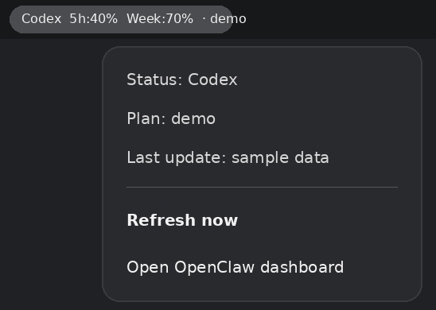

# OpenClaw Usage Indicator (GNOME Shell Extension)

A **product-style GNOME Shell top-bar indicator** that shows OpenClaw/Codex usage windows (e.g. **5h / Week remaining**) with **adaptive refresh** (fast when active, slow when idle).




## What it shows
- Top bar label like: `Codex 5h:85% Week:87%`
- Menu (click indicator):
  - Provider / plan
  - Last update timestamp
  - **Refresh now**
  - **Open OpenClaw dashboard** (`http://127.0.0.1:18789/`)

## How it works
- Usage source: `openclaw status --usage --json`
- “Active vs idle” heuristic: reads the last update timestamp from:
  - `~/.openclaw/agents/main/sessions/sessions.json`

## Requirements
- GNOME Shell **46** (tested on Ubuntu GNOME / Wayland)
- `openclaw` CLI available locally

## Install

### Option A: install from ZIP (recommended)
1. Download `openclaw-usage-indicator@clawd.zip` from GitHub Releases.
2. Install it:

```bash
gnome-extensions install --force openclaw-usage-indicator@clawd.zip
```

3. **Log out and log back in** (Wayland often requires this).
4. Enable:

```bash
gnome-extensions enable openclaw-usage-indicator@clawd
```

### Option B: install from repo checkout
See [`gnome-extension/INSTALL.md`](./gnome-extension/INSTALL.md).

## Troubleshooting
- If `gnome-extensions info ...` shows `State: ERROR`, check:

```bash
gdbus call --session --dest org.gnome.Shell.Extensions --object-path /org/gnome/Shell/Extensions --method org.gnome.Shell.Extensions.GetExtensionErrors openclaw-usage-indicator@clawd
```

- On Wayland, changes to extensions are sometimes not picked up until **logout/login**.

## Support

[](https://ko-fi.com/V7V01UDZTK)

## Development
Extension sources live in:
- `gnome-extension/openclaw-usage-indicator@clawd/`

Pack ZIP:

```bash
cd gnome-extension
zip -r openclaw-usage-indicator@clawd.zip openclaw-usage-indicator@clawd
```
